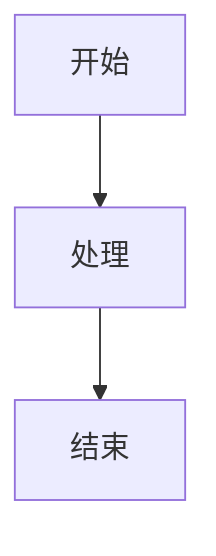
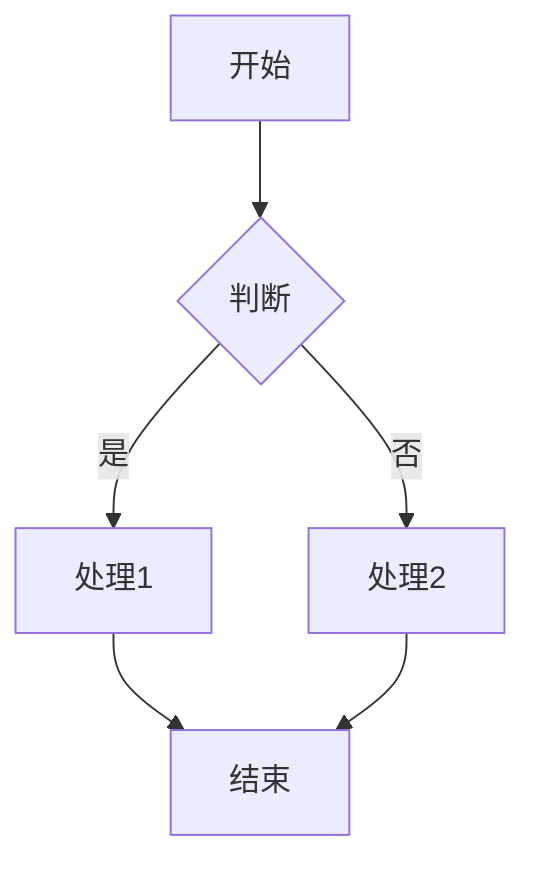
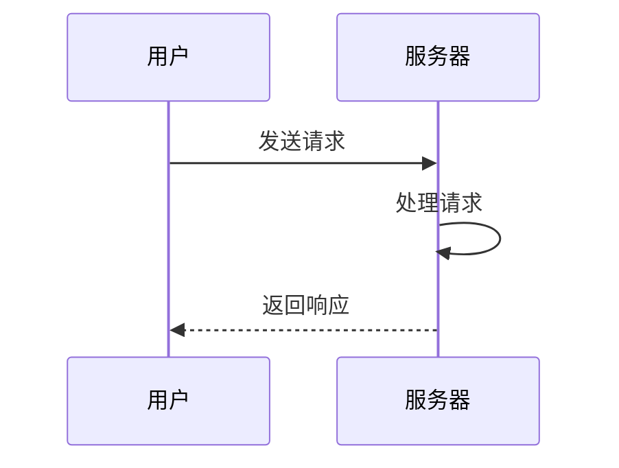
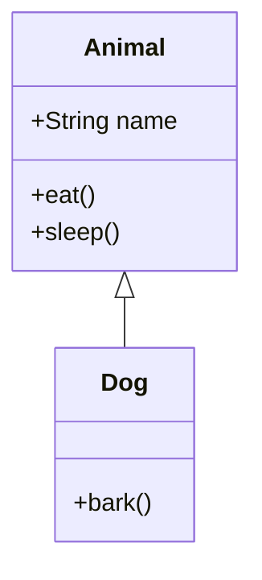
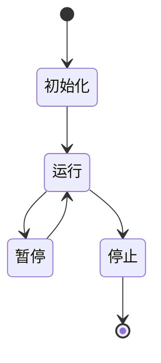

# Mermaid 渲染问题修复说明
## 问题描述

生成的文档中 Mermaid 图表没有正确被渲染，显示为源代码而不是图表。

## 根本原因

Mermaid 渲染问题通常由以下原因引起：

1. **代码块标记错误** - 使用了 `plantuml` 而不是 `mermaid`
2. **Mermaid 语法错误** - 使用了已弃用的语法或语法不正确
3. **Markdown 渲染器不支持** - 某些 Markdown 渲染器不支持 Mermaid
4. **缩进问题** - 代码块缩进不正确

## 解决方案

### 1. 强化 SummaryAgent 的 Mermaid 指导

修改 SummaryAgent 的 Instruction，提供更详细的 Mermaid 使用指南：

```
7. 【图表辅助】对于复杂的概念、流程或架构，使用 Mermaid 图表进行辅助说明
   - 使用三个反引号加 mermaid 代码块（注意：必须是 mermaid，不是 plantuml）
   - 例如：流程图、时序图、类图、部署图等
   - 图表要清晰、有标注、易于理解
   - Mermaid 会在 Markdown 中自动渲染为图片
   - 常用的 Mermaid 图表类型：
     * 流程图：graph TD 或 graph LR
     * 时序图：sequenceDiagram
     * 类图：classDiagram
     * 状态图：stateDiagram-v2
     * 甘特图：gantt
   - 确保 Mermaid 语法正确，避免使用已弃用的语法
```

### 2. 强化 ReviewerAgent 的 Mermaid 检查

修改 ReviewerAgent 的评审标准，增加对 Mermaid 渲染的检查：

```
6. 【图表辅助】（必须满足）
   - 对于复杂的概念、流程或架构，是否使用了 Mermaid 图表？
   - 图表是否清晰、有标注、易于理解？
   - 图表是否会在 Markdown 中自动渲染为图片（而不是源代码）？
   - Mermaid 代码块的格式是否正确（必须是 mermaid 标记，不是 plantuml）？
   - Mermaid 语法是否正确（避免使用已弃用的语法）？
   - 是否有应该添加图表但没有的地方？
```

## Mermaid 最佳实践

### 1. 正确的代码块格式

**正确：**
```markdown

```

**错误：**
```markdown
```plantuml
graph TD
    A[开始] --> B[处理]
    B --> C[结束]
```
```

### 2. 常用的 Mermaid 图表类型

#### 流程图（Flowchart）


#### 时序图（Sequence Diagram）


#### 类图（Class Diagram）


#### 状态图（State Diagram）


### 3. 常见错误

| 错误 | 原因 | 修复 |
|------|------|------|
| 显示为源代码 | 使用了 plantuml 标记 | 改为 mermaid |
| 图表不显示 | 语法错误 | 检查 Mermaid 语法 |
| 缩进混乱 | 代码块缩进不正确 | 确保代码块正确缩进 |
| 中文显示乱码 | 字体问题 | 使用支持中文的 Markdown 渲染器 |

## 验证 Mermaid 渲染

### 在线工具
- [Mermaid Live Editor](https://mermaid.live) - 在线编辑和预览 Mermaid 图表

### 本地验证
1. 使用支持 Mermaid 的 Markdown 编辑器（如 VS Code + Markdown Preview Enhanced）
2. 使用支持 Mermaid 的 Markdown 渲染器（如 GitHub、GitLab）

## 修复后的行为

修复后，SummaryAgent 将：
1. 正确使用 `mermaid` 标记而不是 `plantuml`
2. 使用正确的 Mermaid 语法
3. 生成能够正确渲染的图表

ReviewerAgent 将：
1. 检查 Mermaid 代码块的格式
2. 验证 Mermaid 语法的正确性
3. 确保图表能够正确渲染

## 编译状态

✅ **项目编译成功，无错误或警告**

## 相关文件

- `agent/summaryAgent.go` - 修改了 Mermaid 使用指南
- `agent/reviewerAgent.go` - 增强了 Mermaid 检查标准

---

**修复时间：** 2025-12-16  
**修复状态：** ✅ 完成
